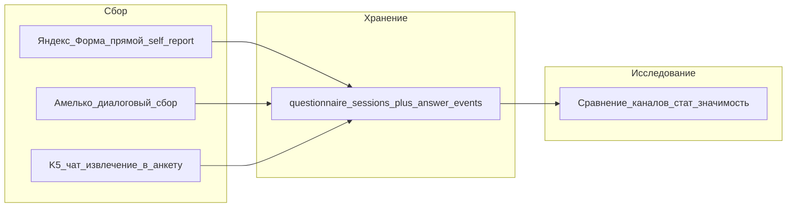

# Мост K5 → анкета K3 и сравнение каналов сбора

**Roadmap** (не MVP): отдельный модуль, который из диалога K5 извлекает ответы на пункты анкеты K3 / C-BARQ(S), пишет их в sessions с явным provenance, и параллельно позволяет сравнить качество/сходство ответов с прямым заполнением (Яндекс.Форма) и с диалоговым каналом **Амелько**.

Связано: [k3-risk-prediction](../components/k3-risk-prediction.md), [k5-ai-chat](../components/k5-ai-chat.md), [pilot-questionnaire](pilot-questionnaire.md), [research-data-app](research-data-app.md), [personal-data-152-fz](personal-data-152-fz.md).

## Зачем

1. **Снизить трение:** владелец уже рассказывает в чате — не заставлять заново проходить всю форму, если факты явно сказаны.
2. **Валидировать канал:** понять, дают ли ответы из диалога (K5 / Амелько) статистически сопоставимую картину с классической формой.
3. **Не смешивать источники в train:** без `channel` / `provenance` модель K3 учится на неоднородном шуме.

## Два связанных контура

| Контур | Роль | Статус |
|--------|------|--------|
| **A. Extractor K5→K3** | Из реплик чата предложить/заполнить пункты анкеты; пользователь подтверждает | Roadmap |
| **B. Channel study** | Сравнить распределения / согласия ответов: Яндекс.Форма vs Амелько (± vs K5-extract) | Roadmap, может жить в отдельном сервисе сбора |

Контуры можно развести по деплою: **B** — отдельный модуль/место сбора данных; **A** — позже в продуктовом монолите рядом с K5. Общее требование — одна схема ответов и поле канала.

## Каналы заполнения (справочник)

| Код `channel` | Как заполняют | Примечание |
|---------------|---------------|------------|
| `yandex_form` | Прямой self-report в [пилотной форме](pilot-questionnaire.md) | Базовый «золотой» канал для сравнения на пилоте |
| `amelko` | Диалоговый сбор через **Амелько** | Отдельный UX; те же item_id / шкалы, что у C-BARQ(S) |
| `k5_extract` | Извлечение из K5 + подтверждение пользователем | Не писать в finished без confirm |
| `volunteer_htmx` | Research-ops UI волонтёра | Уже в плане [research-data-app](research-data-app.md) |

На каждом `questionnaire_sessions` / `answer_events` (или эквиваленте в отдельном сборщике): **`channel`**, при extract — **`confidence`**, **`source_message_ids`**, флаг **`user_confirmed`**.

## Модуль A — извлечение из K5

### Поведение

1. В диалоге K5 фиксируются утверждения, маппящиеся на `global_number` / item C-BARQ(S).
2. Модуль предлагает черновик ответов (не silent write в finished).
3. Пользователь подтверждает / правит → `answer_events` с `channel=k5_extract`, `user_confirmed=true`.
4. Неподтверждённое **не** идёт в train K3 и не считается полным C-BARQ.

Текст чата **нельзя** автоматически считать надёжным C-BARQ-ответом (уже зафиксировано в [k3-risk-prediction](../components/k3-risk-prediction.md)).

### Минимальный контракт

- Вход: `dog_id` / session, фрагменты диалога, каталог вопросов.
- Выход: список `{question_id, value, confidence, evidence_span}` + UI confirm.
- Идемпотентность: повторный extract не дублирует events без новой confirm-сессии.

## Модуль B — сравнение каналов (стат. значимость)

**Гипотеза исследования:** ответы `amelko` (и при наличии `k5_extract`) не смещены относительно `yandex_form` по ключевым пунктам / domain scores настолько, чтобы ломать K3.

### Дизайн (черновик)

| Элемент | Предложение |
|---------|-------------|
| Единицы сравнения | Item-level (0–4 / N/A) и/или domain scores после harmonization |
| Парный дизайн (предпочтительно) | Одна собака / один респондент: форма + Амелько в коротком окне; порядок каналов рандомизировать |
| Непарный | Две когорты с ковариатами (порода, срок дома, волна) — слабее, нужна осторожность |
| Метрики согласия | Cohen’s κ / weighted κ, ICC, Spearman ρ по items; по доменам — корреляции и Bland–Altman |
| «Стат. значимость» | Не p-value ради p-value: заранее N, поправки на множество сравнений, equivalence / TOST если цель — «каналы достаточно близки» |
| Стратификация | По `wave`, типу пункта (aggression vs fear), длине диалога Амелько |

Отдельный пакет: `ml/channel_compare/` или notebooks в контуре сбора — не смешивать с inference API K3.

### Деплой

Допустимо **отдельное место сбора** (лёгкий сервис / бот Амелько + склад ответов), синхронизация в research-ops Postgres через ingest с `channel` и `provenance`. Не обязателен тот же процесс, что product K5.

## 152-ФЗ

- Сообщения чата и ответы анкеты привязаны к человеку → **ПДн**; цель и согласие должны покрывать *извлечение из диалога* и *сравнение каналов*, не только «заполнить форму».
- Минимизация: в extract хранить evidence_span / id реплик по политике retention, не весь лог чата в training export.
- Подтверждённые ответы → ops; для ML — обезличенный export **с** `channel`, без контактов.
- Хостинг сбора и чата — РФ-контур; Яндекс.Форма уже в пилоте — см. [consent-v1-pilot-form](consent-v1-pilot-form.md).
- Скор K3 по извлечённым полям — не оформлять как юридически значимое авторешение о человеке (ст. 16).

При сомнении по формулировке согласия для Амелько/K5 — юрист; чеклист: [personal-data-152-fz](personal-data-152-fz.md).

## Что не делать на MVP

- Silent autofill finished-анкеты из K5 без confirm.
- Смешивать `yandex_form` + `amelko` + `k5_extract` в один train-set без `channel` и без отчёта о смещении.
- Считать p < 0.05 на малой пилотной N доказательством «каналы эквивалентны».

## Открытые вопросы

- [ ] Уточнить продукт **Амелько**: отдельный бот vs бренд диалогового сбора; тот же item-текст, что в Яндекс.Форме?
- [ ] Парный протокол: одна собака — два канала, или разные когорты?
- [ ] Порог `confidence` + обязательность confirm для каждого item vs пакетом.
- [ ] Нужна ли отдельная версия согласия для extract из чата.
- [ ] Где физически крутится модуль B до product-K5 (отдельный compose vs тот же research-ops).

## Связанные страницы

- [k3-risk-prediction](../components/k3-risk-prediction.md)
- [k5-ai-chat](../components/k5-ai-chat.md)
- [pilot-questionnaire](pilot-questionnaire.md)
- [research-data-app](research-data-app.md)
- [data-harmonization](data-harmonization.md)
- [mvp-verifiable-metrics](../ml/mvp-verifiable-metrics.md)
