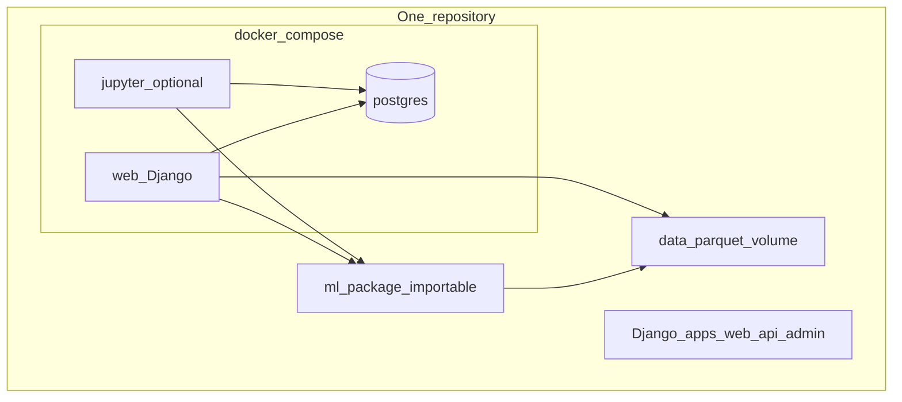
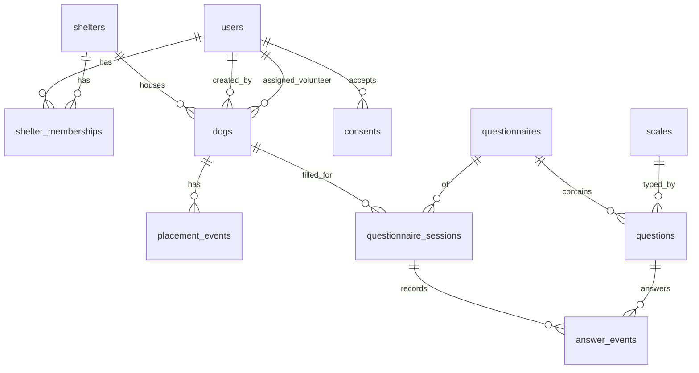

# Research data app — внутреннее приложение сбора данных

Концепция внутреннего (expert/admin) контура.

## Для чего

Наполнение БД для обучения моделей и разметки **до** owner-facing продукта.
На этапе исследования данные в базу будем заносить через бот в ТГ. Новый владелец заполняет анкету; админ управляет данными и рассылками. Это не K5-чат и не приложение для усыновителя.

Источник схемы: [app-ideas-notes](../sources/app-ideas-notes.md) (`_app_ideas/_database_architecture.md`).

## Архитектура MVP

**Modular monolith:** один продуктовый репозиторий, один процесс Django, один `docker compose up`. Микросервисы не делаем. Границы — Django apps и пакет `ml/`.

Knowledge wiki (`barko-docs`) остаётся отдельно от кода приложения.



| Контейнер в compose | Роль |
|---------------------|------|
| `db` | PostgreSQL — единственная БД |
| `web` | Django: UI + Admin + Ninja API + management-команды |
| `jupyter` (опционально) | Ноутбуки поверх того же `ml/` и той же БД |
| `worker` (позже) | Celery из того же образа |

**Правило:** новая фича = Django app или `ml.*`, не новый HTTP-сервис.

### Структура репозитория (ориентир)

```text
barko/
  docker-compose.yml
  config/
  apps/
    users/
    shelters/
    dogs/
    questionnaires/
  ml/
  notebooks/
  data/
  manage.py
```

## Стек

| Слой | Выбор |
|------|--------|
| Bootstrap | [cookiecutter-django](https://github.com/cookiecutter/cookiecutter-django) |
| DB | PostgreSQL |
| Backend | Django 6 |
| Auth | django-allauth + **Groups** (`volunteer` / `admin`; `expert` позже) |
| API | Django Ninja (+ OpenAPI) |
| Questionnaire UI | Django templates + HTMX |
| Admin | Django Admin (± Unfold) |
| Deploy | Один docker-compose: `web` + `db` (+ `jupyter`) |

**Не брать на MVP:** микросервисы, Mongo/ClickHouse/lake, отдельные репозитории web/ml, custom таблицы `roles`/`user_roles`, тяжёлые SaaS-стартеры.

## Ops vs training

Один Postgres + файлы в `data/`. Open subsets — через `ml.ingest`; anonymized export — `ml.export`. См. [data-harmonization](data-harmonization.md).

## Модель данных

Канон из `_database_architecture.md` с уточнениями для миграций.



### Организации и доступ

| Таблица | Поля (суть) | Заметки |
|--------|-------------|---------|
| `shelters` | id, name, description, address, contact_info, timestamps | Без `owner_id` |
| `shelter_memberships` | user_id, shelter_id, member_role (`employee` \| `volunteer` \| `director`), timestamps | Object-scope «свой приют» |
| `users` | id, name, email, phone, contact, timestamps | App-роли — **Django Groups**, не колонка `group` как единственный ACL |

### Собаки и placement (лейблы K3)

| Таблица | Поля (суть) | Заметки |
|--------|-------------|---------|
| `dogs` | name, sex, neutered, status, description, shelter_id, assigned_volunteer_id, owner_id (adopter, nullable), birthday, breed, mixed, created_by_id, **provenance**, timestamps | `status`: `shelter` / `home` / `back_shelter` / `overexposure`; `adopted_at` — опциональный кэш, не замена events |
| `placement_events` | dog_id, code (`shelter_started` / `home_started` / `back_shelter` / `overexposure_started`), created_at | Как HelpDog: [helpdog-forum-adoptions](../datasets/helpdog-forum-adoptions.md); несколько циклов на собаку |

### Согласия (152-ФЗ)

| Таблица | Поля |
|--------|------|
| `consents` | user_id, type, accepted_at, version |

Нормы и чеклист: [personal-data-152-fz](personal-data-152-fz.md), саммари закона — [fz-152-personal-data](../sources/fz-152-personal-data.md). PII только в ops; training — обезличенный export.

### Анкеты

| Таблица | Поля (суть) | Заметки |
|--------|-------------|---------|
| `questionnaires` | id, name, **slug** (`cbarq_s_42`, `cbarq_long_100`, позже shelter-cbarq), description, timestamps | См. [c-barq](c-barq.md); при необходимости добавить `version` |
| `scales` | type, min_value, max_value | int-диапазон, text, date |
| `questions` | questionnaire_id, **global_number** (item_id C-BARQ), order_number, **domain**, text, scale_id | `global_number` стабилен между локализациями; `order_number` — порядок в UI |
| `questionnaire_sessions` | user_id, dog_id, questionnaire_id, status (`draft` \| `finished` \| `canceled`), **wave** (0/7/14/30, nullable), client_metadata, timestamps | Longitudinal — [mvp-verifiable-metrics](../ml/mvp-verifiable-metrics.md) |
| `answer_events` | id, session_id, question_id, value_num, value_text, value_date, **author_id**, created_at | Append-only; текущий ответ = последний event по `(session_id, question_id)` |

`domain_scores` на MVP считать в `ml.export`, не обязательно хранить в OLTP. Отдельный `audit_log` — позже; история ответов + Django Admin log достаточны для v0.

Не смешивать open-import с живыми собаками без `provenance` (`barko_ops` \| `padova` \| `wolfram` \| …).

## Роли (MVP)

| Роль | Может | Реализация |
|------|--------|------------|
| Волонтёр | CRUD собак своего приюта (через membership); анкета частями; динамика ответов | Group `volunteer` + `shelter_memberships` |
| Админ | Пользователи, memberships, приюты, каталог анкет | Group `admin` / staff |
| Эксперт | Read + заметки | **Отложено** |

## Порядок работ (v0)

1. Cookiecutter-django + `ml/` + compose (`web` + `db`).
2. Groups + Admin; login/signup; `consents`.
3. Миграции по схеме выше; seed C-BARQ(S) 42 пункта.
4. CRUD shelters/dogs/placement в Admin.
5. HTMX-анкета волонтёра (draft/finish, история `answer_events`).
6. `ml.export` → Parquet; `ml.ingest` для open subsets.

**Критерий v0:** `docker compose up`; волонтёр завёл собаку, заполнил анкету в 2 захода с правкой ответа; админ выдал доступ; есть выгрузка для K3.

## Предусмотреть заранее

- Версии/slug опросника; Shelter C-BARQ как отдельный `slug` при необходимости.
- Placement events → таргет возврата для [K3](../components/k3-risk-prediction.md).
- PII только в ops; в training — hash dog_id + ответы.
- Лицензия C-BARQ — research UI/export без публичного dump item-текстов.
- Напоминания о статусе пристройства (бот) — позже, не блокирует схему.
- Один lockfile зависимостей для web и jupyter.

## Отложено

- Экспертный контур и `expert_notes`
- Микросервисы; ClickHouse/Mongo; SPA; merge open+own в UI
- K5 / owner UX (модули в том же монолите позже)
- Отдельный `audit_log`

## Связанные страницы

- [app-ideas-notes](../sources/app-ideas-notes.md)
- [c-barq](c-barq.md)
- [personal-data-152-fz](personal-data-152-fz.md)
- [fz-152-personal-data](../sources/fz-152-personal-data.md)
- [data-harmonization](data-harmonization.md)
- [k3-risk-prediction](../components/k3-risk-prediction.md)
- [mvp-verifiable-metrics](../ml/mvp-verifiable-metrics.md)
- [helpdog-forum-adoptions](../datasets/helpdog-forum-adoptions.md)
- [adoption-return](adoption-return.md)
