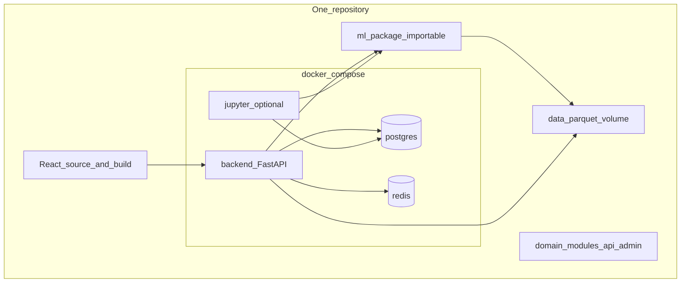
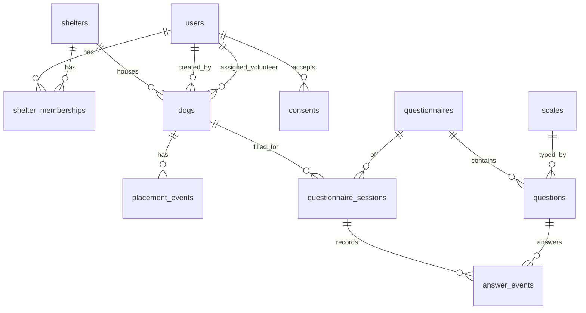

# Research data app — внутреннее приложение сбора данных

Концепция внутреннего (expert/admin) контура.

## Для чего

Наполнение БД для обучения моделей и разметки **до** owner-facing продукта.
На этапе исследования данные в базу будем заносить через бот в ТГ. Новый владелец заполняет анкету; админ управляет данными и рассылками. Это не K5-чат и не приложение для усыновителя.

Источник схемы: [app-ideas-notes](../sources/app-ideas-notes.md) (`_app_ideas/_database_architecture.md`).

## Архитектура MVP

**Modular monolith:** один продуктовый репозиторий, один backend FastAPI, один frontend React, один `docker compose up`. Микросервисы не делаем. Границы — доменные Python-модули, frontend routes и пакет `app.ml`.

Knowledge wiki (`barko-docs`) остаётся отдельно от кода приложения (`MIPT/startup/hvostun`).

Основа: официальный [Full Stack FastAPI Template](https://github.com/fastapi/full-stack-fastapi-template). Он даёт auth и user/admin dashboard, но не универсальный Django-подобный CRUD для предметных моделей. Для внутренней CRUD-админки — integration spike [FastAdmin](https://github.com/vsdudakov/fastadmin); fallback — минимальные React CRUD-страницы.



| Контейнер в compose | Роль |
|---------------------|------|
| `db` | PostgreSQL — единственная OLTP-БД |
| `backend` | FastAPI + SQLModel + Alembic + auth/API |
| frontend build | React/TypeScript + Tailwind/shadcn; не отдельный production-контейнер, обслуживается backend |
| `redis` | admin sessions/cache; Celery broker позже |
| `jupyter` (опционально) | Ноутбуки поверх того же `ml/` и той же БД |
| `worker` (позже) | Celery из того же образа |

**Правило:** новая фича = доменный модуль или `app.ml.*`, не новый HTTP-сервис.

### Структура репозитория (ориентир)

```text
MIPT/startup/hvostun/
  compose.yml
  backend/
    app/
      api/routes/
      domains/
        shelters/
        dogs/
        questionnaires/
        consents/
      admin/
      ml/
    alembic/
    notebooks/
    pyproject.toml
  frontend/
    src/
  data/
```

## Стек

| Слой | Выбор |
|------|--------|
| Bootstrap проекта | [full-stack-fastapi-template](https://github.com/fastapi/full-stack-fastapi-template) |
| DB | PostgreSQL |
| ORM / migrations | SQLModel/SQLAlchemy + Alembic |
| Backend | FastAPI + Pydantic |
| Auth | JWT/auth из шаблона; `is_superuser` + app memberships/roles |
| API | FastAPI + OpenAPI + generated frontend client |
| UI | React + TypeScript + Tailwind CSS + shadcn/ui |
| Admin | User dashboard из шаблона; FastAdmin spike для domain CRUD |
| Deploy | Один Compose: `backend` + `db` + `redis` (+ optional `jupyter`) |

`fastapi-users` не добавляем: auth уже реализован в официальном шаблоне, а библиотека находится в maintenance mode. CRUDAdmin не является основной зависимостью, пока его авторы помечают проект как experimental.

**Не брать на MVP:** микросервисы, Mongo/ClickHouse/lake, отдельные репозитории frontend/backend/ml, второй auth framework, PyTorch до tabular baseline.

## Ops vs training

Один Postgres + файлы в `data/`. Open subsets — через `ml.ingest`; anonymized export — `ml.export`. См. [data-harmonization](data-harmonization.md).

## Модель данных

Канон из `_database_architecture.md` с уточнениями для миграций.



### Организации и доступ

| Таблица | Поля (суть) | Заметки |
|--------|-------------|---------|
| `shelters` | id, name, description, address, contact_info, timestamps | Без `owner_id` |
| `shelter_memberships` | user_id, shelter_id, member_role (`employee` \| `volunteer` \| `director`), timestamps | Object-scope «свой приют» |
| `users` | id, name, email, phone, contact, `is_superuser`, timestamps | Системный superuser из шаблона; object-scope — через memberships и API permissions |

### Собаки и placement (лейблы K3)

| Таблица | Поля (суть) | Заметки |
|--------|-------------|---------|
| `dogs` | name, sex, neutered, status, description, shelter_id, assigned_volunteer_id, owner_id (adopter, nullable), birthday, breed, mixed, created_by_id, **provenance**, timestamps | `status`: `shelter` / `home` / `back_shelter` / `overexposure`; `adopted_at` — опциональный кэш, не замена events |
| `placement_events` | dog_id, code (`shelter_started` / `home_started` / `back_shelter` / `overexposure_started`), created_at | Как HelpDog: [helpdog-forum-adoptions](../datasets/helpdog-forum-adoptions.md); несколько циклов на собаку |

### Согласия (152-ФЗ)

| Таблица | Поля |
|--------|------|
| `consents` | user_id, type, accepted_at, version |

Нормы и чеклист: [personal-data-152-fz](personal-data-152-fz.md), саммари закона — [fz-152-personal-data](../sources/fz-152-personal-data.md). PII только в ops; training — обезличенный export.

### Анкеты

| Таблица | Поля (суть) | Заметки |
|--------|-------------|---------|
| `questionnaires` | id, name, **slug** (`cbarq_s_42`, `cbarq_long_100`, позже shelter-cbarq), description, timestamps | См. [c-barq](c-barq.md); при необходимости добавить `version` |
| `scales` | type, min_value, max_value | int-диапазон, text, date |
| `questions` | questionnaire_id, **global_number** (item_id C-BARQ), order_number, **domain**, text, scale_id | `global_number` стабилен между локализациями; `order_number` — порядок в UI |
| `questionnaire_sessions` | user_id, dog_id, questionnaire_id, status (`draft` \| `finished` \| `canceled`), **wave** (0/7/14/30, nullable), client_metadata, timestamps | Longitudinal — [mvp-verifiable-metrics](../ml/mvp-verifiable-metrics.md) |
| `answer_events` | id, session_id, question_id, value_num, value_text, value_date, **author_id**, created_at | Append-only; текущий ответ = последний event по `(session_id, question_id)` |

`domain_scores` на MVP считать в `app.ml.export`, не обязательно хранить в OLTP. Для административных изменений нужен audit: либо FastAdmin hooks, либо отдельные audit events.

Не смешивать open-import с живыми собаками без `provenance` (`hvostun_ops` \| `padova` \| `wolfram` \| …).

## Роли (MVP)

| Роль | Может | Реализация |
|------|--------|------------|
| Волонтёр | CRUD собак своего приюта (через membership); анкета частями; динамика ответов | `shelter_memberships` + FastAPI permission dependencies |
| Админ | Пользователи, memberships, приюты, каталог анкет | `is_superuser` / app-role + internal admin |
| Эксперт | Read + заметки | **Отложено** |

## Порядок работ (v0)

1. Официальный Full Stack FastAPI Template + Redis + `app.ml/`.
2. Существующий auth + memberships/permissions + `consents`.
3. SQLModel-модели и Alembic-миграции; seed C-BARQ(S) 42 пункта.
4. FastAdmin integration spike; затем CRUD shelters/dogs/placement.
5. React-анкета (draft/finish, история `answer_events`).
6. `app.ml.export` → Parquet; `app.ml.ingest` для open subsets.

**Критерий v0:** `docker compose up`; волонтёр завёл собаку, заполнил анкету в 2 захода с правкой ответа; админ выдал доступ; есть выгрузка для K3.

## Предусмотреть заранее

- Версии/slug опросника; Shelter C-BARQ как отдельный `slug` при необходимости.
- Placement events → таргет возврата для [K3](../components/k3-risk-prediction.md).
- PII только в ops; в training — hash dog_id + ответы.
- Лицензия C-BARQ — research UI/export без публичного dump item-текстов.
- Напоминания о статусе пристройства (бот) — позже, не блокирует схему.
- Один Python lockfile (`uv.lock`) для backend/ML/Jupyter.
- Adminer, Jupyter и Redis не публикуются в production.

## Отложено

- Экспертный контур и `expert_notes`
- Микросервисы; ClickHouse/Mongo; merge open+own в UI
- K5 / owner UX (модули в том же монолите позже)
- Celery worker до появления реальной фоновой задачи
- **Мост K5→анкета + сравнение каналов** (Яндекс.Форма vs Амелько; поле `channel` на sessions) — может быть отдельный сервис сбора: [k5-k3-answer-bridge](k5-k3-answer-bridge.md)

## Связанные страницы

- [app-ideas-notes](../sources/app-ideas-notes.md)
- [c-barq](c-barq.md)
- [personal-data-152-fz](personal-data-152-fz.md)
- [fz-152-personal-data](../sources/fz-152-personal-data.md)
- [data-harmonization](data-harmonization.md)
- [k3-risk-prediction](../components/k3-risk-prediction.md)
- [mvp-verifiable-metrics](../ml/mvp-verifiable-metrics.md)
- [helpdog-forum-adoptions](../datasets/helpdog-forum-adoptions.md)
- [adoption-return](adoption-return.md)
- [k5-k3-answer-bridge](k5-k3-answer-bridge.md) — roadmap каналов сбора и extract из K5
